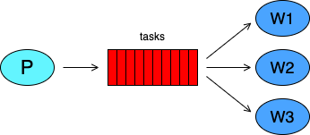
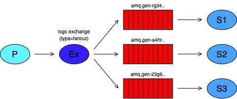
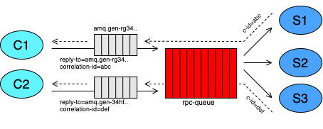
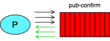

# RabbitMQ concepts and usage
Examples and explanations of RabbitMQ concepts and usage in Go. Taken from the official RabbitMQ tutorials, 
with extended examples and additional clarifications.

In all examples we assume that a RabbitMQ instance is up and running at `127.0.0.1:5672`. The `rabbit.sh` file 
contains a script to start such an instance in a Docker image. Note that all the things that could be persisted 
by RabbitMQ are cleaned by this Docker image when it stops (e.g. persistent queues).

# 1. Hello World

This example contains a small program that can be started in consumer o producer mode; a **producer** (sender) sends 
messages to a queue, and a **consumer** (receiver) receives messages from a queue. It's a "Hello World" example.

Producing means nothing more than sending. A program that sends messages is a producer. Consuming has a similar 
meaning to receiving. A consumer is a program that mostly waits to receive messages. Note that the producer, the
consumer, and the message broker do not have to reside on the same host; indeed in most applications they don't. 
An application can be both a producer and consumer too.


In this simple example, the producer connects to the Rabbit message broker (the server), declares (creates) a queue
and send some messages to it. The receiver similarly connects to the broker, declares the queue and starts consuming
the messages from the queue. Declaring a queue is an idempotent operation and it's a good practice to perform it on 
both the consumer and the producer side, to ensure that the queue exists upon connection. 

To start the example:
```shell
# Start the producer.
go run ./01_hello-world --mode producer

# In one or more other shells, start the consumers.
go run ./01_hello-world --mode consumer
```

# 2. Worker Queues

This example creates a work queue that will be used to distribute time-consuming tasks among multiple workers. The
main idea behind work queues (aka task queues) is to avoid performing resource-intensive tasks immediately and have
to wait for them. Instead, we want to schedule the task to be done later. We encapsulate a task as a message and 
send it to a queue. A running worker process will pop the tasks/messages and execute the job. When you run many
workers at the same time the tasks will be equally distributed among them.



If a worker dies, we'd like the task to be delivered to another worker. In order to make sure a message is never
lost, Rabbit supports **message acknowledgments**. An ack(nowledgement) is sent back by the consumer to tell Rabbit
that a particular message has been received and processed, so it can be deleted safely. If a consumer dies (or a 
timeout happens) before completing the job, no ack is sent and the task could be taken by another worker. Furthermore, 
we need to mark both the queue and messages as durable in order to avoid losing jobs if the Rabbit server dies.

Finally, another important aspect must be considered. The default _fair dispatching_ of messages assigns one job per 
connected worker, that is, it just blindly dispatches every _n-th message to the n-th consumer_ (and the n-th client
will buffer all n-th messages that it can fetch and store). As a consequence some workers could remain more time idle
than others. Think about two workers connected and every odd message being more intensive and time-consuming. In this
scenario the second worker is assigned the more intensive jobs, while the first one will remain generally idle for 
more time. In order keep all the workers busy in an equal way, we can set the **prefetch count** to the value of 1.

A prefetch of one tells Rabbit not to give more than one message to a worker/consumer at a time. More precisely, 
don't dispatch a new message to a worker until it has processed and acknowledged the previous one. Instead, Rabbit 
will dispatch the next message to the next consumer that is not still busy (if any).

To start the example:
```shell
# Start the jobs producer.
go run ./02_workers-queue --mode producer

# We can start as many worker as we want, more workers means more 
# processing power and more jobs done in a period of time. Run in
# one or more other shells: 
go run ./02_workers-queue --mode worker
```

# 3. Publisher/Subscribers 

In previous examples we sent and received messages to and from a queue. In the full messaging model of Rabbit there
are also **exchanges**. The core idea of the RabbitMQ messaging model is that the producer never sends any messages
directly to a queue. Actually, quite often the producer doesn't even know if a message will be delivered to any
queue at all. Instead, the producer can only send messages to an exchange. Then, Rabbit (which is a message broker 
indeed) will send those messages to one or more queues _bound_ to that exchange.

An exchange is a very simple thing. On one side it receives messages from producers and on the other side it pushes
them to queues. The exchange must know exactly what to do with a message it receives. The rules for exchanges are 
defined by their type (**direct**, **topic**, **headers** and **fanout**).



This example is a logging system that implements the publisher/subscriber design pattern. The _publisher_ will send
all the produced logs to an exchange, then they will be routed to all _subscribers_ (the consumers). To do this we
will use an exchange of type **_fanout_** which just broadcasts all the messages it receives to all the queues it knows.

When a consumer/subscriber joins we create a new empty queue with a random name, a queue that is specific for that
subscriber. Then we bind the queue to the `logs` exchange. Note that the subscriber is not interested in messages
sent before it is connected to the server. Secondly, when the subscriber disconnects, the queue will be dropped.
Basically, queues will be generated and destroyed dynamically when consumers connect and disconnect (and those
queues will be filled with flowing messages only).

To start the example:
```shell
# Start the publisher.
go run ./03_publisher-subscribers --mode publisher

# We can start as many subscribers as we want, 
# similarly to a real subscription system. Run
# in one or more other shells: 
go run ./03_publisher-subscribers --mode subscriber
```

# 4. Direct Routing

In this example we're build a logging system as before, but we are going to make it possible to subscribe only to a 
subset of messages sent by the publisher. The structure is similar to the previous example, but we'll use different 
**routing/binding keys** in both queue bindings and message sending.

Routing keys are strings used by producers to control where messages must be sent. Specifically, the messages are 
routed from the exchange to the queues that are bound to that exchange with a compatible binding key (binding keys 
are like the routing keys, but for consumers). Different types of exchanges have different types of matching criteria.
The _fanout_ exchange used in the previous example just sends all messages to all bound queues, regardless of the 
keys used. To build this example we use a **_direct_** exchange instead. The routing algorithm behind a direct 
exchange is simple: a message goes to the queues whose binding key exactly matches the routing key of the message.


In the logging system depicted in the figure above, the direct exchange has three queues bound to it. The first queue
is bound with the binding key `info`, the second queue is bound with the binding key `warn` and the third queue has 
two bindings, one with the binding key `warn` and the other one with `error`. Here, a message published to the 
exchange with a routing key _info_ will be routed to the first queue. Messages with a routing key of _warn_ will go 
to second and third queues. Messages with a routing key of _error_ will go to the third queue only. All other 
messages will be discarded. It is perfectly legal to bind multiple queues with the same binding key. 

In the example the producer send logs with different severities to an exchange (the severities are reflected in the
related routing keys of the system). Subscribers/consumers can listen for logs with one or more severities, binding 
their freshly-created and exclusive queue with the related binding keys. While consuming their queues, consumers will
receive only the subset of messages they subscribed for.

To start the example:
```shell
# Start the logs producer (the publisher).
go run ./04_direct-routing --mode publisher

# Start a subscriber for info logs, in a new shell.
go run ./04_direct-routing --mode subscriber --sevs info

# Start a subscriber for warn logs, in a new shell.
go run ./04_direct-routing --mode subscriber --sevs warn

# Start a subscriber for warn and error logs, in a new shell. 
go run ./04_direct-routing --mode subscriber --sevs warn-error
```

# 5. Topics Routing

There is another type of exchange named **_topic_**. With these type of exchange we can route messages with multiple
criteria. Messages sent to a topic exchange can't have an arbitrary routing key - it must be a list of words, delimited
by dots (e.g. _quick.orange.rabbit_). Binding queues to an exchange use a similar format, but there are some special 
characters the star **`*`** and the hash **`#`**. The matching rules are similar to those of the _direct_ exchange with some
differences: a star (`*`) can substitute for exactly one word, a hash (`#`) can substitute for multiple words. When
these special characters aren't used in bindings, the topic exchange will behave just like a direct one.


This simple program is a more advanced logging system where both the severities and the source form the routing key,
following the pattern `<facility>.<severity>`. In the consumer both members can be a special character, to represent 
the two forms of wildcards. Based on the routing key used on the producer side, bound queues should or should not 
receive some messages. E.g.:

- `nginx.*`       will receive all messages from the nginx facility
- `*.error`       will receive only error logs from all facilities
- `cron.info`	  will receive only info logs from the cron facility

To start the example:
```shell
# Start the logs producer (publisher).
go run ./05_topics-routing --mode publisher

# Start a subscriber that listens for errors from 
# all sources, in a different shell. 
go run ./05_topics-routing --mode subscriber --bind *.error

# Start a subscriber for info logs from nginx, 
# in a different shell.
go run ./05_topics-routing --mode subscriber --bind nginx.info
```

# 6. Remote Procedure Calls

This example is a simple implementation of a pattern called **_Remote Procedure Call (RPC)_**. With this pattern we 
want to run a function on a remote computer, collecting the response on the client side. The system is composed by one
or more _clients_ and one or more _RPC servers_. In the example clients send _RPC request_ messages to a shared work 
queue (the RPC requests queue, named `rpc-queue`), while servers read those requests, perform the job, and reply with
_RPC response_ messages in a _consumer exclusive callback queue_.



In order to receive the response in a specific queue we need to send the callback queue address with the RPC request.
We use the `reply-to` field for this purpose. Callback queues are exclusive and generated upon clients connection. 
RPC responses are auto-acked from the queue while RPC requests must be acknowledged by the server when it finishes 
working on that task. There is another field, the `correlation-id` used to correlate the response with its related 
RPC request.

Note that we send one RPC request per time and we wait for the response synchronously. It's probably better to send
multiple RPC requests in batch, record all correlation IDs and check this list while receiving responses (not done 
here since we are interested in the architecture not in performance).

To start the example:
```shell
# Start the RPC server (actually, three concurrent servers are started).
go run ./06_rpc --mode server

# Start one or more clients in different shells.
go run ./06_rpc --mode client
```

# 7. Publish Confirmations

Publisher confirms are a RabbitMQ extension to implement **reliable publishing**. When publisher confirms are enabled on
an AMQP channel, messages published by clients are confirmed asynchronously by the message broker, meaning they have 
been taken care of on the server side. We can imagine publisher confirms as acknowledges that the server send to the 
producer. Publisher confirms are not enabled by default and must be enabled at the channel level.



We use several approaches. In the first one we send each message waiting synchronously the broker confirmation. The 
confirmation is performed serially, that is, after each message we wait the confirmation (so we don't batch messages 
to be published and confirmation to be received). This approach is simple, but not efficient in terms of performance.

In the second approach we send messages in batches and we wait for confirmations in batches. After every `n`messages
sent we want to receive `n` broker confirmation (basically for all of them). Working with batches of messages improves
the throughput drastically over the first approach. There are still some drawbacks, the more obvious is that we block
the entire process waiting for confirmations. As an example, if the last message in a batch is particularly slow to
be confirmed, we are basically stopped waiting a single confirmation, when there are available resources on both the
client and the server side that could process other concurrent messages. 

In the third approach (not showed here) we can asynchronously and independently send messages and receive confirmations,
eliminating blocking scenarios generated by single messages. Slow publications/confirmations do not influence other 
publications/confirmations. If, for instance, we accumulate too many messages to be confirmed, we could slow the
producer process to handle backpressure. The system could be still slowed down due to a general non-responsiveness
of the network or the Rabbit server, but there will not be the possibility that a _single_ message could hang the
system.

To start the example:
```shell
# Start the producer with publisher confirms.
go run ./07_pub-confirm
```
